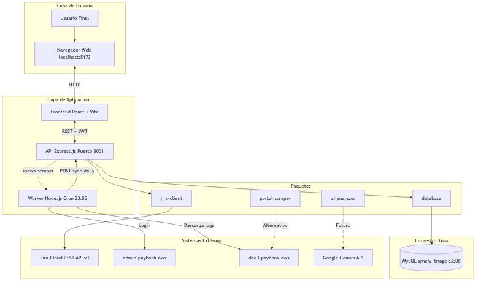

# Syncfy Support Automation

An automated support and triage pipeline designed to manage Level 1 support operations. The system integrates with the Jira API and internal log servers to extract, analyze, and triage system latency and extraction failures. 

This repository operates as a monorepo containing a full-stack dashboard and a dedicated web scraping worker to automate repetitive debugging tasks.

## System Architecture

The project is divided into distinct modular applications and packages:

- **Frontend (`apps/frontend`)**: A React application built with Vite that serves as the command center. It features a dashboard for active tasks, Jira ticket details, and a historical metrics view utilizing Recharts.
- **API (`apps/api`)**: An Express.js backend that bridges the React application with the MySQL database and the Jira REST API. It also acts as the orchestrator for the scraping worker.
- **Worker (`apps/worker`)**: A dedicated Node.js process leveraging Playwright and Axios. It provides a hybrid scraping strategy to bypass Nginx security barriers and automatically download `.log` files from internal AWS servers.
- **Database (`packages/database`)**: A centralized module handling all MySQL interactions for tickets, historical metrics, and downloaded job logs.

### Architecture Diagrams



**Para presentaciones:** [Flujo completo de inicio a fin](docs/flujo-completo-inicio-fin.md) — Diagrama intuitivo del recorrido del usuario


Detailed flow diagrams and sequence diagrams are available in the `docs/` folder:

- **[Flujo Completo (Inicio a Fin)](docs/flujo-completo-inicio-fin.md)** — Diagrama intuitivo para presentar a compañeros
- **[Architecture Flow](docs/architecture-flow.md)** — High-level component diagram (PNG, SVG, Mermaid)
- **[Flow Sequences](docs/architecture-flows-sequence.md)** — Sequence diagrams for auth, tickets, scraping, stats sync
- **[Requirements Spec](docs/REQ-DIAGRAMA-FLUJO-ARQUITECTURA.md)** — Full infrastructure architect specification

## Setup and Installation

### Prerequisites
- Node.js (v18 or higher)
- Docker and Docker Compose
- Access to the internal AWS VPN

### Environment Variables
Duplicate the `.env.example` files within `apps/api` and `apps/worker` to create `.env` files. Ensure the following critical credentials are provided:
- Jira API Token (`JIRA_API_TOKEN`)
- AWS Admin Portal Credentials (`PAYBOOK_ADMIN_USER`, `PAYBOOK_ADMIN_PASS`)
- Database Connection Strings (`DB_HOST`, `DB_USER`, `DB_PASSWORD`)

### Running the Application

1. **Start the Database**:
   Initialize the MySQL instance using Docker Compose:
   ```bash
   docker-compose up -d
   ```
   The database schema will be automatically provisioned via the `init.sql` script.

2. **Install Dependencies**:
   Install dependencies across all workspaces from the project root:
   ```bash
   npm install
   ```

3. **Launch the Services**:
   Start both the Frontend and the API concurrently:
   ```bash
   npm run dev
   ```
   The frontend will be available at `http://localhost:5173` and the API at `http://localhost:3000`.

## Features

- **Jira Synchronization**: Automatically polls pending tickets from the designated Jira board (`DAQ Workload`).
- **Hybrid Log Scraping**: Automates the navigation of secure internal directories to extract raw server logs, storing them persistently in the database.
- **Historical Analytics**: Tracks daily developer productivity and backlog volume, rendering the data through transparent, overlaid bar charts.
- **Centralized Artifacts**: Logs and ticket actions are aggregated allowing developers to conduct root cause analysis directly from the dashboard.
