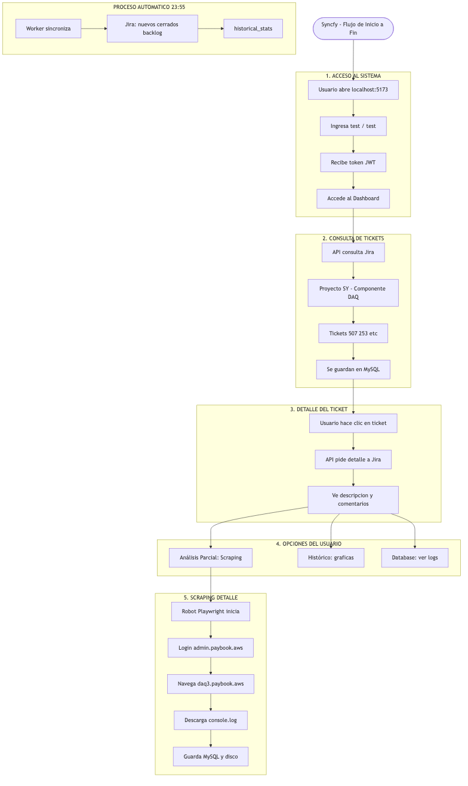

# Syncfy — Flujo Completo de Inicio a Fin

Diagrama intuitivo para presentar el sistema a compañeros. Muestra el recorrido del usuario y los procesos automáticos.

## Vista General

*[Ver SVG (vector)](./diagrams/07-flujo-completo-inicio-fin.svg)*

---

## Resumen por Fases

| Fase | Qué pasa |
|------|----------|
| **1. Acceso** | Usuario abre la app, ingresa credenciales (test/test), recibe token y entra al Dashboard |
| **2. Tickets** | API consulta Jira (proyecto SY, componente DAQ), obtiene tickets (507, 253, etc.) y los guarda en MySQL |
| **3. Detalle** | Usuario hace clic en un ticket, la API pide el detalle a Jira y muestra descripción y comentarios |
| **4. Opciones** | Usuario puede: **Análisis Parcial** (scraping), **Histórico** (gráficas) o **Database** (ver logs) |
| **5. Scraping** | Robot Playwright hace login en admin.paybook.aws, navega a daq3.paybook.aws, descarga el log y lo guarda en MySQL y disco |
| **Automático** | Cada día a las 23:55 el Worker sincroniza estadísticas desde Jira y las guarda en `historical_stats` |

---

## Puntos Clave para la Presentación

- **Inicio:** Usuario abre `localhost:5173` y hace login
- **Tickets:** Todo viene de Jira (proyecto SY, componente DAQ)
- **Scraping:** El robot usa Playwright para entrar al portal interno y descargar logs
- **Persistencia:** MySQL guarda tickets, logs y estadísticas
- **Automático:** Sincronización diaria de métricas sin intervención
